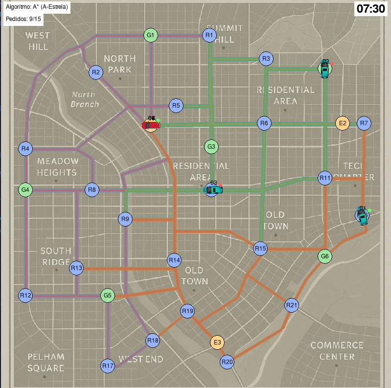

# TaxiGreen Fleet Dispatch System

A fleet management simulator developed in Python that uses classical graph search algorithms to optimize vehicle dispatch and route planning for the fictional taxi company TaxiGreen.

The system manages electric and combustion vehicles and proccesses real-time passenger requests, calculating routes and assigning them to the most suitable vehicle while considering traffic, vehicle autonomy, capacity and environmental preferences.

<p align="center">
  
</p>

Project developed for the Artificial Intelligence course in the 3rd year of Uminho's Software Engineering bachelors.

For a more in-depth description and analysis of the implemented algorithms based on different metrics check the [`report`](Report.pdf) (PT).

**Grade:** 18/20 🏅

## Team:
* Juliana Silva ([`JulianaSilva8`](https://github.com/JulianaSilva8))
* Sofia Couto ([`sbmco05`](https://github.com/sbmco05))
* Soraia Pereira ([`sooraia`](https://github.com/sooraia))
* Tiago Soares ([`tiagosoaresv`](https://github.com/tiagosoaresv))

## Dependencies

- Python 3.x
- Pygame

## Setup

To run the program without the graphical interface:
```
python3 -m main
```

To run the program with the graphical interface:
```
python3 -m main_gui
```
